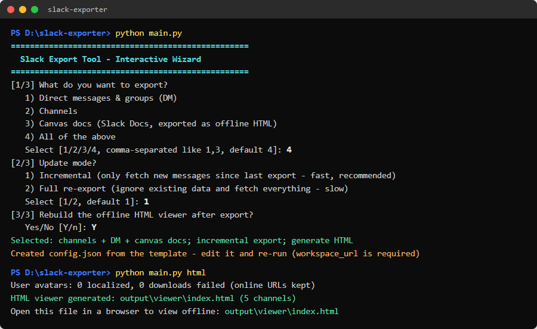
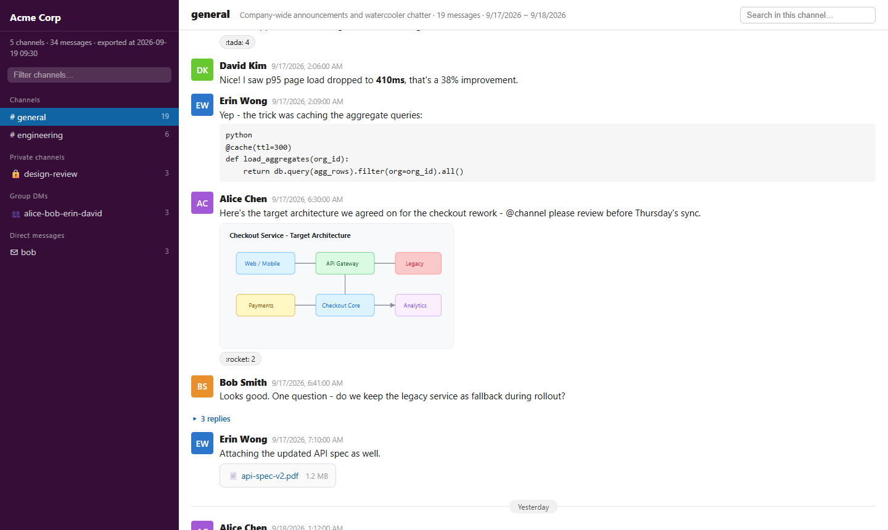
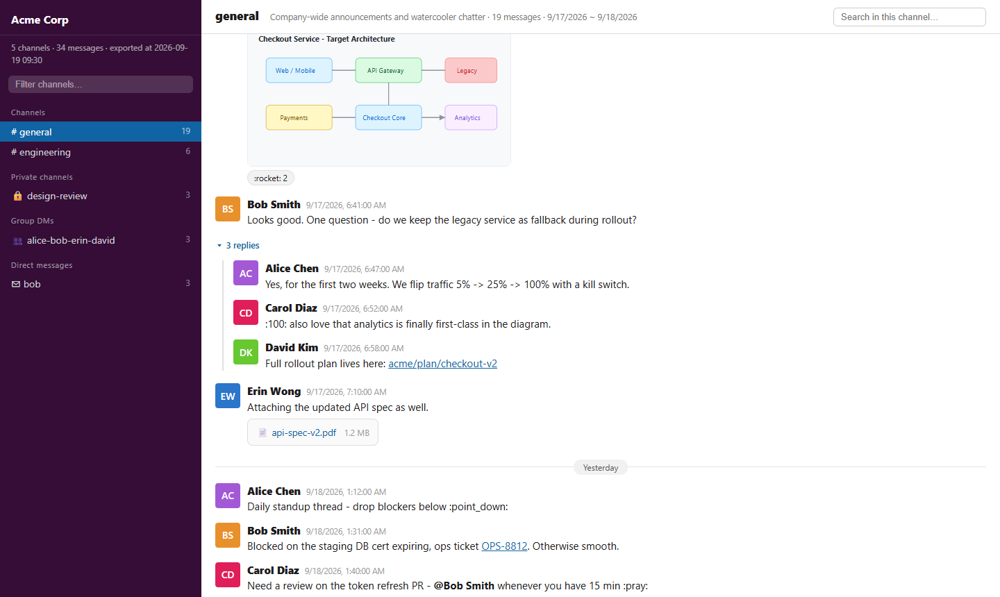
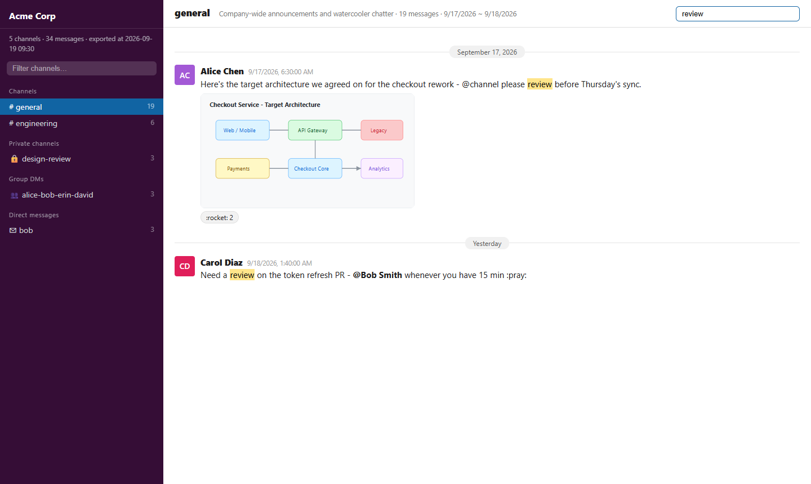

# slack-exporter

**[English](README.md)** | **[简体中文](README.zh-CN.md)**

将你的 Slack 工作区（私信、群组、频道、画板文档和附件）导出为本地 JSON
+ 可离线浏览的 HTML 查看器，使用你自己已登录的账号，无需管理员审批或官方
导出申请。

> 本工具用于个人备份/归档你有权限访问的会话。请遵守你所在工作区的规定
> 和当地法律法规，不要用于导出你无权访问的数据。

## 核心优势

- **无需管理员同意** —— 用你自己的账号在真实浏览器会话中导出。不用找
  工作区管理员、不用提交官方导出申请、不用等待审批。
- **增量同步** —— 随时重复运行，只拉取上次导出之后的新消息并合并进
  本地归档。
- **本地离线 HTML 查看** —— 自动生成类 Slack 界面（侧栏、线程、表情
  回复、附件），直接打开 `output/viewer/index.html` 即可，`file://`
  完全离线可浏览——即使频道被删或你已离开工作区，历史记录仍在本地。
- **离线全文检索** —— 在查看器中筛选频道、按消息内容或作者搜索，命中
  结果高亮显示。所有数据都不出本机。

## 效果截图

首次运行：交互引导 + 生成离线查看器：



离线查看器（演示数据，英文界面 —— 跟随浏览器语言自动切换为中文）：

| 浏览已导出频道 | 线程回复 |
|:---:|:---:|
|  |  |



## 功能特性

- **无需管理员导出** - 以普通用户身份通过真实浏览器登录
  （Playwright + 本机 Chrome/Edge）
- **运行时中英文自适应** - 导出时自动适配中英文 Slack 客户端界面；
  离线查看器界面跟随浏览器语言自动切换（可用 `?lang=en` / `?lang=zh`
  强制指定）
- **两种导出模式**
  - `browser`（默认）：模拟用户打开频道并向上滚动，捕获客户端自身的
    API 响应。对限流友好、支持断点续传，并带服务端完整性校验
  - `api`：直接调用 Web API（速度快，但易触发限流）
- **增量更新** - 重复运行只拉取新消息并合并
- **附件** - 文件、图片和 Slack 画板文档下载到本地并链接；画板互链
  本地化为可离线跳转的网络
- **离线 HTML 查看器** - 类 Slack 界面：频道侧栏、线程、表情回复、
  消息搜索、头像缓存；支持 `file://` 直接打开
- **抗崩溃** - 按频道断点文件、浏览器崩溃后自动重启、线程/校验重试标记

## 安装

```bash
pip install -r requirements.txt
playwright install chromium   # 备用浏览器；优先使用本机 Chrome/Edge
```

将 `config.example.json` 复制为 `config.json` 并设置 `workspace_url`
（如 `https://your-team.slack.com`）。`email`/`password` 可选 - 邮箱验证码
和 MFA 可以在浏览器窗口中手动输入。

## 使用

```bash
python main.py                  # 交互式向导
python main.py login            # 仅登录
python main.py export           # 增量导出
python main.py export --update full        # 全量重新导出
python main.py export --scope dm           # 仅私信/群组
python main.py export --scope docs         # 仅画板文档
python main.py html             # 重新生成离线查看器
```

首次运行会打开浏览器窗口：完成登录（支持邮箱验证码 / 2FA），会话保存到
`session.json` + `.profile/`，之后自动复用。

输出结果：

```
output/raw/       原始 JSON 数据（每个频道一个文件）
output/files/     附件和离线画板页面
output/viewer/index.html   用任意浏览器打开，完全离线
```

## 配置项说明（config.json）

| 键 | 默认值 | 说明 |
|---|---|---|
| `workspace_url` | - | 工作区地址，必填 |
| `email` / `password` | 空 | 可选的登录自动填充 |
| `download_files` | `true` | 下载附件 |
| `max_file_mb` | `200` | 跳过大于此大小的附件 |
| `channel_delay_s` | `2` | 频道间暂停秒数 |
| `scroll_wait_ms` | `900` | 滚动步骤间等待毫秒 |
| `scroll_idle_limit` | `15` | 顶部无新内容时放弃前的空闲轮数 |
| `thread_pace_s` | `0.5` | 线程拉取间隔秒数 |
| `max_scrolls` / `max_channel_seconds` | `500` / `900` | 单频道上限 |

## 注意事项

- 需要本机安装 Chrome 或 Edge（内置 Chromium 仅作后备）
- `config.json`、`session.json`、`storage.json` 和 `.profile/` 包含
  个人凭据 - 切勿分享或提交
- 会话令牌会过期；遇到鉴权错误运行 `python main.py login --relogin`

## 许可证

MIT
